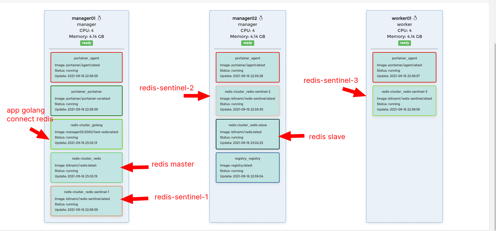
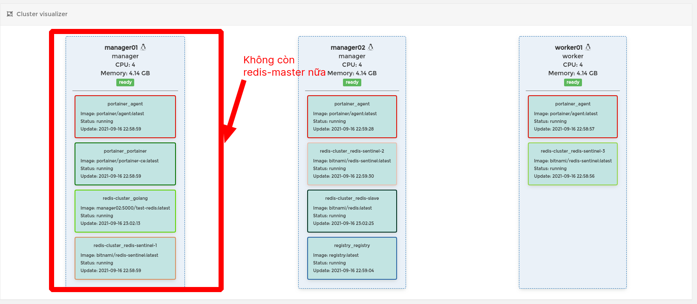
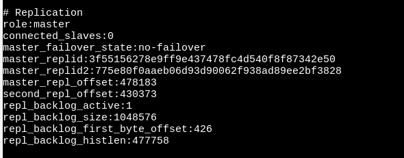

## Triển khai 2 node redis: master-slave trên 2 máy ảo

- Redis master ở máy ảo manager01
- Redis slave ở máy ảo manager02

## Triển khai 3 node redis sentinel trên 3 máy ảo(số node sentinel là lẻ và chạy độc lập trên các host)

## Triển khai 1 app golang connect redis bẳng redis-sentinel sử dụng

github.com/go-redis/redis/v8

Build image golang rồi đẩy lên registry manger02:5000 Chi tiết xem lại bài hướng dẫn của thầy Cường.

Trong code có sử dụng 3 biến môi trường là địa chỉ của 3 node redis-sentinel

Deploy stack bằng nội dung sau

```
version: "3.8"
networks:
  my-network:
    external: false

services:
  redis:
    image: 'bitnami/redis:latest'
    environment:
      - REDIS_REPLICATION_MODE=master
      - REDIS_PASSWORD=123
    networks:
      - my-network
    ports:
      - '6379'
    deploy:
      placement:
        constraints: # Chỉ định node quản lý
          - node.role == manager
          - node.hostname == manager01
  redis-slave:
    image: 'bitnami/redis:latest'
    environment:
      - REDIS_REPLICATION_MODE=slave
      - REDIS_MASTER_HOST=redis
      - REDIS_MASTER_PASSWORD=123
      - REDIS_PASSWORD=123
    ports:
      - '6379'
    depends_on:
      - redis
    networks:
      - my-network
    deploy:
      placement:
        constraints: # Chỉ định node quản lý
          - node.role == manager
          - node.hostname == manager02
  redis-sentinel-1:
    image: 'bitnami/redis-sentinel:latest'
    environment:
      - REDIS_MASTER_PASSWORD=123
      - REDIS_SENTINEL_PASSWORD=123
    depends_on:
      - redis
      - redis-slave
    ports:
      - '26379'
    networks:
      - my-network
    deploy:
      placement:
        constraints: # Chỉ định node quản lý
          - node.role == manager
          - node.hostname == manager01
  redis-sentinel-2:
    image: 'bitnami/redis-sentinel:latest'
    environment:
      - REDIS_MASTER_PASSWORD=123
      - REDIS_SENTINEL_PASSWORD=123
    depends_on:
      - redis
      - redis-slave
    ports:
      - '26379'
    networks:
      - my-network
    deploy:
      placement:
        constraints: # Chỉ định node quản lý
          - node.role == manager
          - node.hostname == manager02
  redis-sentinel-3:
    image: 'bitnami/redis-sentinel:latest'
    environment:
      - REDIS_MASTER_PASSWORD=123
      - REDIS_SENTINEL_PASSWORD=123
    depends_on:
      - redis
      - redis-slave
    ports:
      - '26379'
    networks:
      - my-network
    deploy:
      placement:
        constraints: # Chỉ định node quản lý
          - node.role == worker
          - node.hostname == worker01
  golang:
    image: manager02:5000/test-redis:latest
    depends_on:
      - redis-sentinel-1
      - redis-sentinel-2
      - redis-sentinel-3
    environment:
      - redis-sentinel-1=redis-sentinel-1
      - redis-sentinel-2=redis-sentinel-2
      - redis-sentinel-3=redis-sentinel-3
    networks:
      - my-network
    ports:
      - '8001:8001'
```




## Logic của code golang là set key trên redis rồi get value của key đó trong redis rồi trả về qua api: 

localhost:8001

Kết quả qua api:


Value của key trong node redis master


## Stop service của node redis-master



## Exec vào node redis-slave để check role xem đã được promote lên thành master chưa

```
redis-cli
``` 
Sau đó dùng lệnh
```
info
```



Call lại localhost:8001 sẽ lag 1 chút nhưng sau đó kết quả vẫn trả vê bình thường

